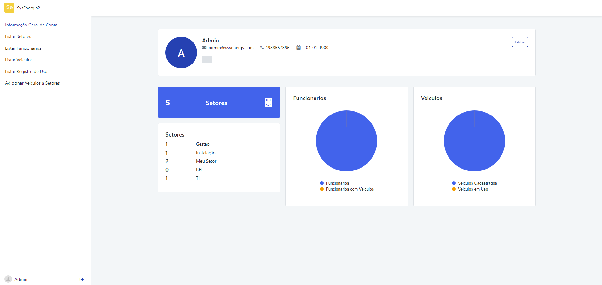
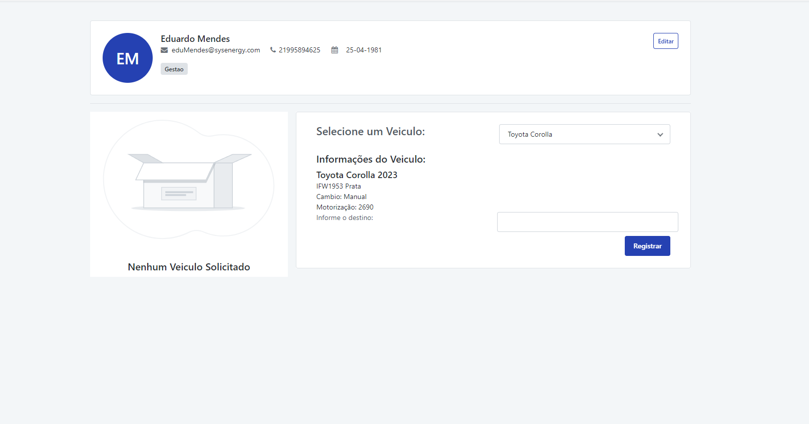
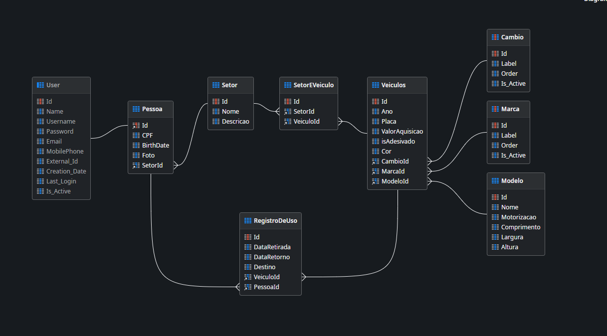

# OutSystems Workshop Project Fleet Organizer App
Efficiently manage and organize your company's car fleet with the Fleet Organizer App. This comprehensive solution provides a streamlined system for tracking the status of each vehicle, managing employee assignments, and facilitating easy car requests. Keep your fleet operations smooth and organized with this user-friendly web application.

**Key Features:**
- Real-time status updates on each vehicle's location and availability.
- Employee assignment tracking for better visibility into car usage.
- Quick and easy car request feature for employees.
- Centralized dashboard for fleet managers to oversee and manage the entire car fleet.

**How to Use:**
Visit the live app to experience the simplicity of managing your car fleet. Navigate through the user-friendly interface to view vehicle details, make car requests, and streamline fleet operations.

**Supported Languages:**
This one will remain in Portuguese for the forseable future, might come back to it and add an option to change the app to english, but for now it is not a priority

**App Url:**
[Fleet App URL](./AppURL.txt)

## User Credentials

To access different areas of the Fleet Organizer App, you can use the following demo/test credentials. Please note that these credentials are for testing purposes only, and we strongly recommend not using them in a production environment.

### Employee Area
- **Username: will add a later date**
- **Password: will add a later date** 

### Admin Area
- **Username: will add a later date**
- **Password: will add a later date**

**Security Note:**
- Change passwords immediately if you suspect any security compromise.
- Avoid using these credentials for any real-world applications.
  
## Project Screenshots
Here are a few screenshots of the project as it is, feel free to check the Screenshots folder to check on everything that the project current has and the how the database is structured

*Admin Homepage.*

*Employee Homepage.*

*Database Diagram.*

## Known Issue:
**Issue 1: Information fields without a mask to prevent user to imput invalid formats**
  - Symptoms: For now there are no masks preventing some information formats to not follow its correct patern, allowing users to enter some invalid information.
  - Resolution: Im aware of the Input Masks Library from the Outsystems forge, and I intent on coming back to this project to fix this.

**Issue 2: Cannot select from the database a car model that has already been registered**
  - Symptoms: Everytime you are going to register a new car into the database, you gotta do the whole model over, I ran into problems trying to use the models already registered into the database and couldnt solve it yet, when you are registering a new car, you gotta register everything related to it.
  - Resolution: Its a database manipulation issue, gotta get a better grasp on how to manipulate data from and into the database to fix this.
  
**Technologies Used:**
- OutSystems Reactive Web for the front end.
- OutSystems Server-side Logic for the back end.

**Future Updates:**
Stay tuned for upcoming features and enhancements. We're committed to continuously improving the Fleet Organizer App to meet your evolving fleet management needs.

**Feedback and Contributions:** I welcome your feedback! Feel free to open issues for suggestions or contribute to the improvement of this web app.
